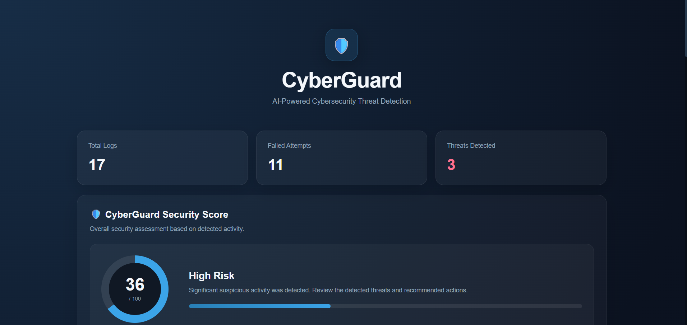

# 🛡️ CyberGuard

## AI-Powered Cybersecurity Threat Detection

CyberGuard is a mini AI-powered cybersecurity platform designed to analyze security logs, detect suspicious login activity, identify potential brute-force attacks, and generate risk assessments using machine learning.

The project combines **Python, FastAPI, Machine Learning, and a web-based dashboard** to provide an interactive cybersecurity monitoring experience.

---

## 📸 Dashboard



---

## 🚀 Features

- 🔍 Security log analysis
- 🚨 Failed login detection
- 🛡️ Brute-force attack detection
- 🤖 Machine learning-based risk analysis
- 📊 AI risk score generation
- ⚠️ Threat-level classification
- 🌐 IP-based threat intelligence
- 📈 Security analytics dashboard
- 💡 Security recommendations
- 📁 Upload and analyze custom `.txt` log files
- ❤️ System health monitoring
- ⚡ FastAPI backend
- 💻 Interactive web dashboard

---

## 🧠 How CyberGuard Works

CyberGuard follows a simple security-analysis pipeline:

```text
Security Logs
     ↓
Log Parsing
     ↓
Failed Login Detection
     ↓
IP Address Analysis
     ↓
Threat Detection
     ↓
Machine Learning Risk Analysis
     ↓
Risk Score & Threat Level
     ↓
Security Recommendations
     ↓
Interactive Dashboard